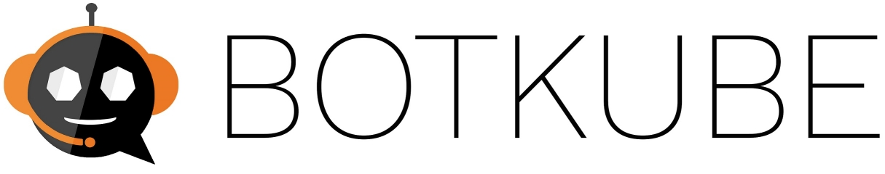

# BotKube
   

For complete documentation visit www.botkube.io

BotKube integration with Slack or Mattermost helps you monitor your Kubernetes cluster, debug critical deployments and gives recommendations for standard practices by running checks on the Kubernetes resources.
You can also ask BotKube to execute kubectl commands on k8s cluster which helps debugging an application or cluster.

## Getting started
Please follow [this](https://www.botkube.io/installation/) for complete BotKube installation guide.

## Architecture

- **Informer Controller:** Registers informers to kube-apiserver to watch events on the configured k8s resources. It forwards the incoming k8s event to the Event Manager
- **Event Manager:** Extracts required fields from k8s event object and creates a new BotKube event struct. It passes BotKube event struct to the Filter Engine
- **Filter Engine:** Takes the k8s object and BotKube event struct and runs Filters on them. Each filter runs some validations on the k8s object and modifies the messages in the BotKube event struct if required.
- **Event Notifier:** Finally, notifier sends BotKube event over the configured communication channel.
- **Bot Interface:** Bot interface takes care of authenticating and managing connections with communication mediums like Slack, Mattermost. It reads/sends messages from/to commucation mediums. 
- **Executor:** Executes BotKube or kubectl command and sends back the result to the Bot interface.

Visit www.botkube.io for Configuration, Usage and Examples.
