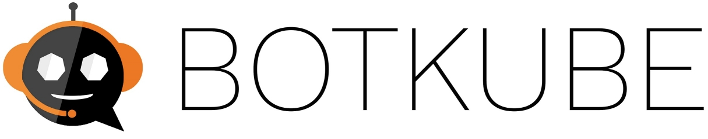

  

  BotKube is a messaging bot for monitoring and debugging Kubernetes clusters.

  
  
  
  
  
  

## Overview

BotKube helps you monitor your Kubernetes cluster, debug critical deployments and gives recommendations for standard practices by running checks on the Kubernetes resources. It integrates with multiple communication platforms, such as [Slack](https://slack.com), [Discord](https://discord.com/), or [Mattermost](https://mattermost.com).

You can also execute `kubectl` commands on K8s cluster via BotKube which helps debugging an application or cluster.

## Getting started

Please follow [this](https://botkube.io/installation/) for a complete BotKube installation guide.

## Documentation

For complete documentation visit [botkube.io](https://botkube.io).

The documentation sources reside on the [botkube-docs](https://github.com/kubeshop/botkube-docs) repository under **content** directory.

## Features

### Execute `kubectl` commands

Same old Kubectl syntax - just a new interface. You do not have to learn anything new! Plus you can configure which `kubectl` commands BotKube can execute. See [configuration](https://botkube.io/configuration/resource/) for details.

  

### Support multiple communicator

BotKube integrates with Slack, Discord, Mattermost, Microsoft Teams, ElasticSearch and outgoing webhook. See [configuration](https://botkube.io/configuration/communication/) syntax for details.

  

### Supports Custom Resources

BotKube can monitor literally any Kubernetes resource including Custom Resource. This enables you to configure alerts on events like - certificate issue if you use [cert-manager](https://cert-manager.io/) or backup failure in case you use backup tools like Velero or Kanister.

  

### Debug Anywhere, Anytime

With `@BotKube` you can monitor and debug Kubernetes deployments from anywhere. You can use e.g. Slack mobile app and get crucial information. The entire team can see what steps have already been taken and avoid duplicated work.

  

### Deploy on any Kubernetes cluster

You can deploy BotKube backend on any Kubernetes cluster, whether it is [K3d](https://k3d.io/v5.4.3/) or cloud managed Kubernetes or anything in between.

## Licence

This project is currently licensed under the [MIT License](https://github.com/kubeshop/botkube/blob/main/LICENSE).
