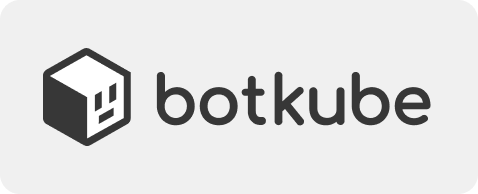
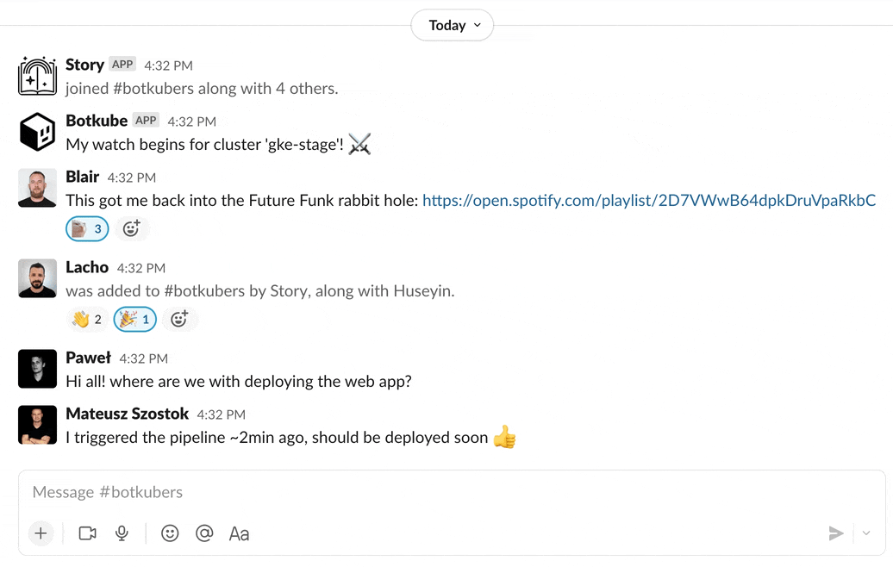

  

  Botkube is a messaging bot for monitoring and debugging Kubernetes clusters.

  
  
  
  
  

## Overview

Botkube helps you monitor your Kubernetes cluster, debug critical deployments and gives recommendations for standard practices by running checks on the Kubernetes resources. It integrates with multiple communication platforms, such as [Slack](https://slack.com), [Discord](https://discord.com/), or [Mattermost](https://mattermost.com).

You can also execute `kubectl` commands on K8s cluster via Botkube which helps debugging an application or cluster.

## Getting started

Please follow [this](https://docs.botkube.io/installation/) for a complete Botkube installation guide.

## Documentation

For full documentation, visit [botkube.io](https://docs.botkube.io). The documentation sources reside on the [botkube-docs](https://github.com/kubeshop/botkube-docs) repository under **content** directory.

## Features

### Execute `kubectl` commands

The same `kubectl` capabilities inside your favorite communicator. You do not have to learn anything new! Plus, you can configure which `kubectl` commands Botkube can execute. See [configuration](https://docs.botkube.io/configuration/) for details.

  

### Use multiple communication platforms

Botkube integrates with Slack, Discord, Mattermost, Microsoft Teams, ElasticSearch and outgoing webhook. See [configuration](https://docs.botkube.io/configuration/communication/) syntax for details.

  

### Monitor any Kubernetes resource

Botkube supports literally any Kubernetes resource, including Custom Resources. For example, if you use [`cert-manager`](https://cert-manager.io/), you can get alerted about certificate issue, or backup failure in case you use backup tools like [Velero](https://velero.io/) or [Kanister](https://kanister.io/).

  

### Debug anywhere, anytime

Using Botkube you can debug your apps deployed on Kubernetes from anywhere. To extract crucial information from the cluster, you can even use mobile communicator apps, like Slack. The entire team can see what steps have already been taken and avoid duplicated work.

  

### Deploy on any Kubernetes cluster

You can deploy Botkube backend on any Kubernetes cluster. It doesn't matter whether it is [K3d](https://k3d.io), managed Kubernetes on a cloud provider, or bare-metal one.

## Licence

This project is currently licensed under the [MIT License](https://github.com/kubeshop/botkube/blob/main/LICENSE).
