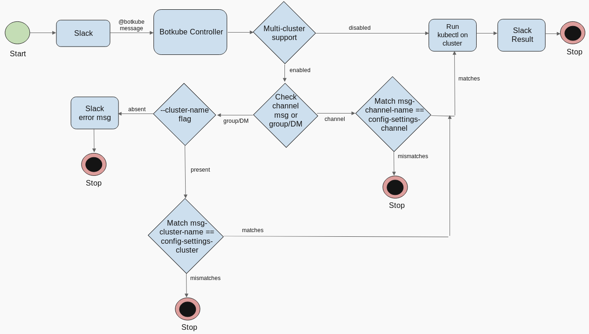

# Multi-cluster Support

#### Assumptions
`@botkube` commands refer to all the commands in the slack bot which currently supports:
- kubectl
- notifier
- ping
    

### Summary
Add Multi-cluster support for Botkube, where a single bot can monitor multiple clusters and respond to `@botkube` commands with cluster specific results.

### Motivation
Currently in multi-cluster scenario, a Slack bot authenticates all the clusters with a same authentication token. Thus running `@botkube` command returns response from all the configured clusters, irrespective of the slack channel or group. For `@botkube` command execution, we need a particular cluster specific output.

### Design

This design approach adds a flag `--cluster-name` to all `@botkube` commands. Use of that flag is optional in a cluster specific channel.

Botkube `Notifier` commands are restricted to a dedicated channel for a cluster only and `--cluster-name` flag is ignored. 

Botkube `ping` command with the `--cluster-name` flag returns `pong` response from the cluster specified in the flag, else you get response from all the clusters. `Ping` command without --cluster-name flag can be used to list all the configured clusters in the slack bot and identify you cluster's name among them.

For `kubectl` commands in a dedicated channel to a cluster, if `--cluster-name` flag is used, it responds with the output for the cluster specified in flag, else it checks if the channel in the request matches the `config.Communications.Slack.Channel` and responds if true else ignores.

For `kubectl` commands in a group, Direct message or channel not dedicated to any cluster, the `--cluster-name` flag is mandatory. The executor checks if the `--cluster-name` flag is present in the request. If yes, it gets the cluster's name from the flag and compares with `c.Settings.ClusterName` from the config file, if it matches then it responds with the required output to the slack bot and if it doesn't match, it ignores the request. And if the `--cluster-name` flag is absent for `kubectl` commands, it responds to the slack bot saying 'Please specify the cluster-name'. 

For example -
```sh
@Botkube get pods --cluster-name={CLUSTER_NAME}
```
where,
`CLUSTER_NAME` is the name of the cluster you want to query.

To get the list of all clusters configured in the slack, you can run the following command in slack.

```sh
@Botkube ping
```

##### Workflow




### Drawbacks
The `--cluster-name` flag is mandated for kubectl and notifier commands resulting additional overhead.

### Alternatives
We can add channel specific authentication token or completely dedicate a channel to a particular cluster which requires changes in the slack code.

