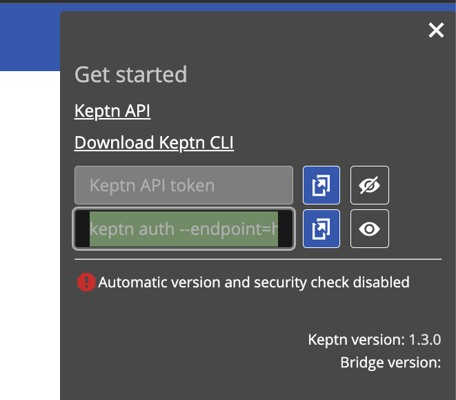
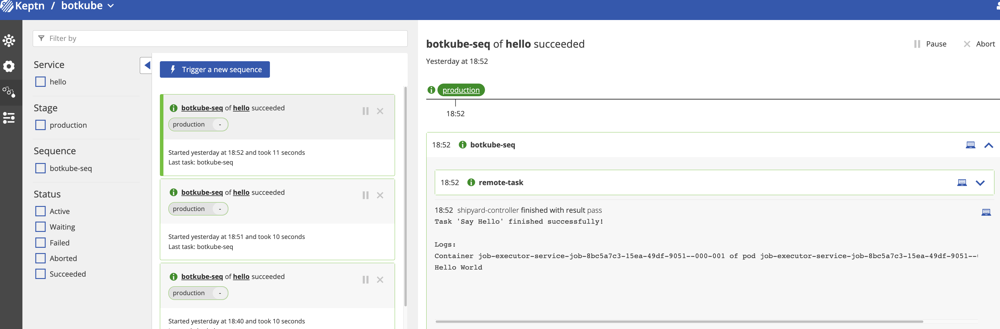
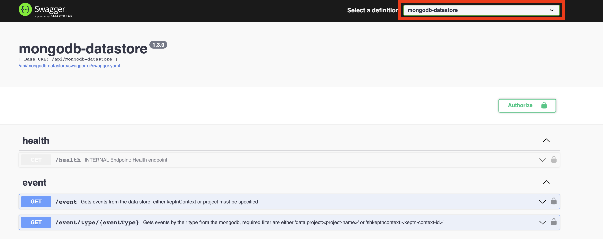
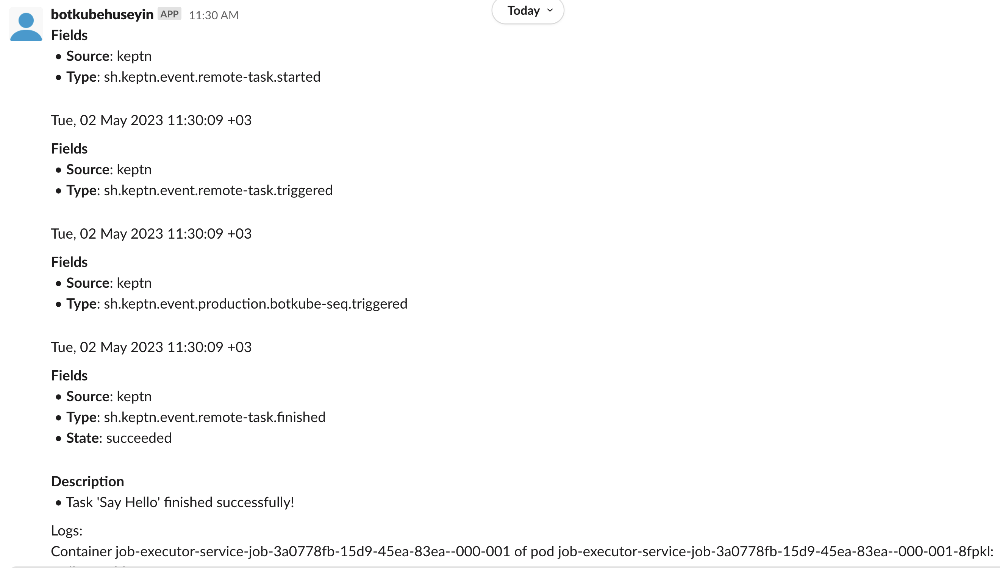

# Implementing Your Own Botkube Plugin - A Real-Life Use Case
Botkube has plugin system that allows you to extend the functionalities of Botkube core to satisfy your requirements. In this article, 
we will implement a Botkube plugin to integrate it with Keptn, a cloud-native application lifecycle management tool for kubernetes.

## Background
Before starting Keptn plugin implementation, let's take a look what it is for, and what kind of use-case it solves for us.
Assume that you have CD flow that ships your features to live environment whenever you merge that specific feature into main branch.
You might want to do a couple of checks before deployment, and Keptn is good for that kind of verifications. You would do a load test with [k6](https://k6.io/), open source load testing
tool, by using in Keptn to do load test and verify results. However, to make it simpler to understand how Keptn works and how to integrate it with Botkube, we will be
deploying a simple task with Keptn and consume Keptn events with Botkube to receive notifications in platforms, e.g. Slack.

## Keptn Installation
You can easily deploy keptn via Helm Chart with the following command.

```shell
helm repo add keptn https://charts.keptn.sh
helm install keptn keptn/keptn -n keptn --create-namespace
kubectl -n keptn port-forward svc/api-gateway-nginx 8080:8080
```

To execute a task in Keptn environment, we can use a Keptn integration which is 'Job Executor Service'. This will help us to execute task
based on our configuration. You can deploy executor service as shown below.

```shell
export JES_VERSION=0.3.0
export TASK_SUBSCRIPTION="sh.keptn.event.remote-task.triggered"

helm upgrade --install --create-namespace -n keptn-jes job-executor-service \
    https://github.com/keptn-contrib/job-executor-service/releases/download/${JES_VERSION}/job-executor-service-${JES_VERSION}.tgz \
    --set remoteControlPlane.autoDetect.enabled="true" \
    --set subscription.pubsubTopic=${TASK_SUBSCRIPTION}
```
Keptn produces lots of events during the lifecycle management, but notice we are only interested in the event type `sh.keptn.event.remote-task.triggered`. Since, we
deploy job executor service in same Kubernetes cluster, it will automatically find Keptn gateway with the flag `remoteControlPlane.autoDetect.enabled="true"`

## Accessing Keptn Gateway
```shell
# Extract username and password
export USER=$(kubectl get secret bridge-credentials -n keptn -o jsonpath={.data.BASIC_AUTH_USERNAME} | base64 -d)
export PASSWORD=$(kubectl get secret bridge-credentials -n keptn -o jsonpath={.data.BASIC_AUTH_PASSWORD} | base64 -d)
echo "username: $USER, password: $PASSWORD"
```

```shell
# Port-forward to Keptn Gateway
kubectl -n keptn port-forward svc/api-gateway-nginx 8080:80
```
You can visit http://localhost:8080 to access Keptn Gateway by providing user and password which we extracted before.

## Keptn CLI
While you can handle everything in Keptn Gateway Dashboard, it would be beneficial to use Keptn CLI to handle things faster. You can install
Keptn CLI with following command.
```shell
# Linux
curl -sL https://get.keptn.sh/ | bash
```

```shell
# MacOS
brew install keptn
```

In order to access Keptn Gateway, you need to authenticate Keptn CLI with following command.
```shell
keptn auth --endpoint=http://localhost:8080/api --api-token=<token>
```
You can copy this command from Keptn Gateway Dashboard under User icon in top right corner.



Now we are ready to create resources in Keptn.
## Create Keptn Project
In Keptn, everything starts with Project where you basically define your Keptn resources. Keptn projects works with Git Upstream that you can also create one as shown below.
```shell
export GITHUB_USERNAME=....
export GITHUB_TOKEN=....
export GITHUB_REPO=...
keptn create project botkube --shipyard=shipyard.yaml --git-user=$GITHUB_USERNAME --git-token=$GITHUB_TOKEN --git-remote-url=$GITHUB_REPO
```
`$GITHUB_USERNAME` and `$GITHUB_TOKEN` is used by Keptn to maintain its state in remote repository which is defined by empty `$GITHUB_REPO`. `--shipyard` parameter
is used to defined project stages each deployment should go through until production stage. You can see an example shipyard file as follows.
```yaml
apiVersion: "spec.keptn.sh/0.2.4"
kind: "Shipyard"
metadata:
  name: "botkube"
spec:
  stages:
    - name: "production"
      sequences:
        - name: "botkube-seq"
          tasks:
            - name: "remote-task"
```
We have only one stage `production` and it contains a task which is named as `remote-task`. Now that we defined our project, let's continue with creating a service as follows.

## Create Keptn Service with Resource
```shell
keptn create service hello --project botkube -y
```
Above command simply creates a `hello` service under `botkube` project. Next step is to add resources to this service, for example a job definition as you can also see below.
```shell
keptn add-resource --project botkube --service hello --stage production --resource jobconfig.yaml --resourceUri job/config.yaml
```
We added job config to `hello` service for `production` stage under `botkube` project. Also, you can see the content of `jobconfig.yaml` below.
```yaml
apiVersion: v2
actions:
  - name: "Hello, Botkuber!"
    events:
      - name: "sh.keptn.event.remote-task.triggered"
    tasks:
      - name: "Say Hello"
        image: "alpine"
        cmd:
          - echo
        args:
          - "Hello World"
```
As you can also understand, it simply provisions a task by using `alpine` image to print `Hello World`. Once the task is started, it will produce an event `sh.keptn.event.remote-task.triggered`. This event
is the one our job executor service interested in. 

## Trigger Keptn Sequence
We have all the resources ready and now we can trigger a sequence to deploy remote task to see the response with following command.
```shell
keptn trigger sequence botkube-seq --project botkube --service hello --stage production
```
You will see the result of the command, but to see everything in detail, you can navigate to Keptn Gateway and see Sequences as follows.



Now that we understand how to trigger a sequence in Keptn, let's take a look how to access its API to consume events to integrate with Botkube.

## Accessing API
You can navigate to http://localhost:8080/api to see Swagger Documentation of Keptn APIs. It contains multiple modules, and to receive events, we can select `mongodb-datastore` from the dropdown.



Notice we already authorized Keptn CLI in previous sections, and we can reuse the token inside `keptn auth ...` command to use in Swagger Authorize to call endpoints in Swagger UI or construct following curl command.

```shell
export KEPTN_TOKEN=...
curl -X 'GET' \
  'http://localhost:8080/api/mongodb-datastore/event?pageSize=20&project=botkube' \
  -H 'accept: application/json' \
-H 'X-Token: $KEPTN_TOKEN'
```
Now we have everything ready to be used in Botkube plugin development, let's continue with our fresh new plugin, Botkube Keptn Plugin!

## Plugin Development
Before implementing Keptn plugin business logic, I would like provide 2 source for plugin development.
- [Botkube Plugin Development Quick Start](https://docs.botkube.io/plugin/quick-start)
- [Implementing Custom Botkube Source Plugin](https://docs.botkube.io/plugin/custom-source)

We assume you are familiar with how to create a plugin project and create boilerplate for a source plugin
now we are ready to implement actual business logic of the Keptn plugin to receive events. You will see partial
examples of the codebase in this article, but don't worry, you can see the full codebase here.

## Plugin Configuration Structure
In order to integrate Botkube with Keptn, Botkube should now the entrypoint of Keptn to consume events. Also, it needs a token
for successful authentication with Keptn. Additionally, we can add filtering parameters like project and service to consume events
for certain project and service. With those information, following Go struct can be used for plugin configuration.

```go
// config.go
package keptn

...
// Config prometheus configuration
type Config struct {
	URL     string        `yaml:"url,omitempty"`
	Token   string        `yaml:"token,omitempty"`
	Project string        `yaml:"project,omitempty"`
	Service string        `yaml:"service,omitempty"`
	Log     config.Logger `yaml:"log,omitempty"`
}
...
```
To have a smooth plugin integration, we can have configuration defaults, and once end user provides their own configuration, we should merge those configs
as follows.
```go
// config.go
package keptn

import "github.com/kubeshop/botkube/pkg/pluginx"

...
// MergeConfigs merges all input configuration.
func MergeConfigs(configs []*source.Config) (Config, error) {
	defaults := Config{}

	var out Config
	// You can see useful utility packages like `pluginx` in Botkube core.
	if err := pluginx.MergeSourceConfigsWithDefaults(defaults, configs, &out); err != nil {
		return Config{}, fmt.Errorf("while merging configuration: %w", err)
	}

	return out, nil
}
...
```
## Simple Keptn Client Implementation
We will implement an SDK to connect Keptn API to consume events. This will be a facade to reduce complexity and coupling.
Keptn already has a [Go SDK](github.com/keptn/go-utils/pkg/api/utils/v2"), and in our client we will initialize an instance of that client and call events endpoint as shown below.

```go
// client.go
package keptn

import (
	api "github.com/keptn/go-utils/pkg/api/utils/v2"
	"time"
)

// Client Keptn client
type Client struct {
	// API refers to Keptn client. https://github.com/keptn/go-utils
	API *api.APISet
}

type GetEventsRequest struct {
	Project  string
	FromTime time.Time
}

type Event struct {
	ID     string
	Source string
	Type   string
	Data   Data
}

type Data struct {
	Message string
	Project string
	Service string
	Status  string
	Stage   string
	Result  string
}

...
// NewClient initializes Keptn client
func NewClient(url, token string) (*Client, error) {
    client, err := api.New(url, api.WithAuthToken(token))

    if err != nil {
        return nil, err
    }

    return &Client{
        API: client,
    }, nil
}

// Events returns only new events.
func (c *Client) Events(ctx context.Context, request *GetEventsRequest) ([]Event, error) {
	fromTime := request.FromTime.UTC().Format(time.RFC3339)
	var events []Event
	res, err := c.API.Events().GetEvents(ctx, &api.EventFilter{
		Project:  request.Project,
		FromTime: fromTime,
	}, api.EventsGetEventsOptions{})
	if err != nil {
		return nil, err.ToError()
	}

	for _, ev := range res {
		data := Data{}
		err := ev.DataAs(&data)
		if err != nil {
			return nil, err
		}
		events = append(events, Event{
			ID:     ev.ID,
			Source: *ev.Source,
			Type:   *ev.Type,
			Data:   data,
		})
	}
	return events, nil

}
```
To summaries above example, `Events` method accepts context and filter request to get events based on the filtering parameters.
That method can return slice of Events or an error. Now that we have a client, let's implement the core of our plugin to call this
Keptn client implementation.

## Keptn Plugin Core
In order to write a source plugin, we need to implement following contracts

```go
// source.go
Stream(ctx context.Context, input source.StreamInput) (source.StreamOutput, error)
Metadata(_ context.Context) (api.MetadataOutput, error)
```
`Stream` is a gRPC endpoint that is consumed by a gRPC client in Botkube core. So, Botkube will stream events from this endpoint.
`Metadata` is used for providing information about Keptn plugin. This will be also used by CI system to generate plugin metadata. 
Metadata can contain plugin configuration details.

In `Stream` method, we need to consume Keptn events as follows.
```go
// source.go
package keptn

const pollPeriodInSeconds = 5
...
func (p *Source) consumeEvents(ctx context.Context, cfg Config, ch chan<- source.Event) {
	keptn, err := NewClient(cfg.URL, cfg.Token)
	log := loggerx.New(cfg.Log)
	exitOnError(err, log)

	for {
		req := GetEventsRequest{
			Project:  cfg.Project,
			FromTime: time.Now().Add(-time.Second * pollPeriodInSeconds),
		}
		res, err := keptn.Events(ctx, &req)
		if err != nil {
			log.Errorf("failed to get events. %v", err)
		}
		for _, event := range res {
			textFields := []api.TextField{
				{Key: "Source", Value: PluginName},
				{Key: "Type", Value: event.Type},
			}
			if event.Data.Status != "" {
				textFields = append(textFields, api.TextField{Key: "State", Value: event.Data.Status})
			}

			var bulletLists []api.BulletList
			if event.Data.Message != "" {
				bulletLists = []api.BulletList{
					{
						Title: "Description",
						Items: []string{
							event.Data.Message,
						},
					},
				}
			}
			msg := api.Message{
				Type:      api.NonInteractiveSingleSection,
				Timestamp: time.Now(),
				Sections: []api.Section{
					{
						TextFields:  textFields,
						BulletLists: bulletLists,
					},
				},
			}
			ch <- source.Event{
				Message:   msg,
				RawObject: event,
			}
		}
		// Fetch events periodically with given frequency
		time.Sleep(time.Second * pollPeriodInSeconds)
	}
}
...
```
Above implementation will poll Keptn endpoint each 5 seconds and will return a Message to Botkube so that Botkube will dispatch this message to configured platform.
Notice, we use `FromTime` parameter to fetch only last 5 seconds windowed events. As you also noticed, we use a special struct `api.Message` for structured message that
you can see advanced details about that [here](https://docs.botkube.io/plugin/interactive-messages).

## Building Plugin
In order to build plugin, you can use following command.
```shell
PLUGIN_DOWNLOAD_URL_BASE_PATH=http://localhost:8080/plugin-dist make gen-plugins-index
```
This will build the plugin, and generate a metadata file for plugin index. `PLUGIN_DOWNLOAD_URL_BASE_PATH` environment variable is used
for defining the base path of plugin download url. Now we have plugin binaries locally, then we can serve them with following command.

```shell
npx serve --listen 8080
```
Once you navigate to http://localhost:8080/dist, you can see the keptn plugin binary. This means, Botkube core can consume this endpoint to donwload and register as Botkube plugin.

## Running Botkube
In order to use Keptn plugin, we can use following repository config in Botkube configuration file.
```yaml
// config.yaml
...
plugins:
  repositories:
    botkube:
      url: http://localhost:8080/plugins-dev-index.yaml
...
```
Above config is just for making Keptn plugin visible to Botkube core, now we can add a Keptn source plugin configuration as follows.
```yaml
'keptn':
  ## Keptn source configuration
  ## Plugin name syntax: <repo>/<plugin>[@<version>]. If version is not provided, the latest version from repository is used.
  botkube/keptn:
    # -- If true, enables `keptn` source.
    enabled: true
    config:
      project: "botkube"
      url: "http://localhost:8080/api"
      token: "keptn_token"
      log:
        level: info
```
All the Keptn configurations are defined under `config` section. Once Botkube application starts, it would stream Keptn plugin and that plugin 
consume the endpoint `http://localhost:8080/api` with query parameters `project=botkube` and with auth headers `X-Token=<keptn_token>`. However, we need to add this
Keptn source to `communications` configuration of Botkube as follows.
```yaml
...
 slack:
    enabled: true
    token: "xoxb-..."
    channels:
      'default':
        name: botkube-demo
        bindings:
          sources:
            - keptn
... 
```
Whenever an event is fired in Keptn, this event will be stored in mongodb-datasource and this will be consumed by
Keptn plugin. Finally, with above configuration, it will be sent to platforms which are defined in `communications` section.


