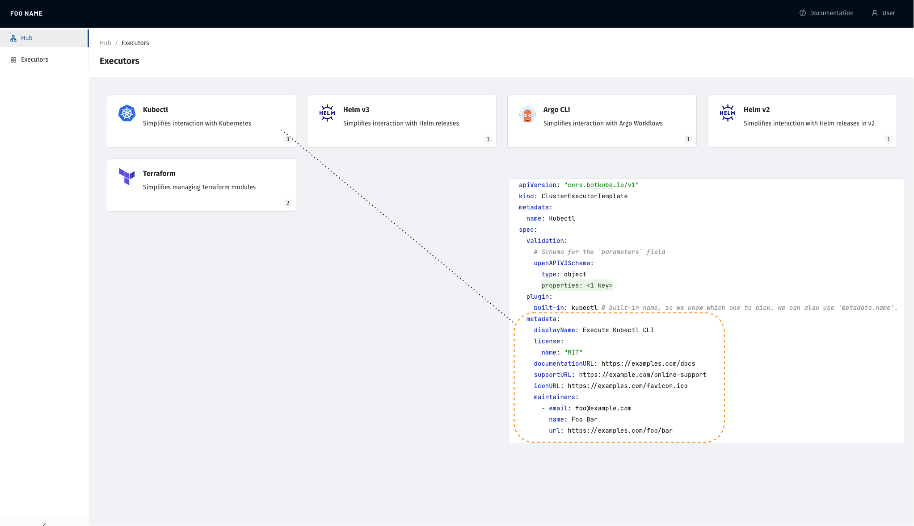
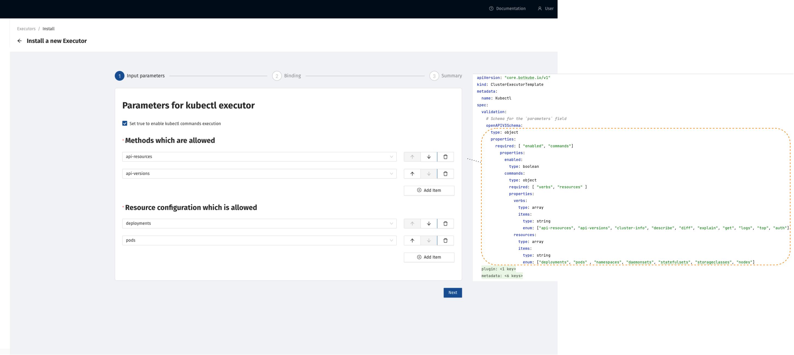

# Configure BotKube via CRs

Created on 2022-06-20 by Mateusz Szostok ([@mszostok](https://github.com/mszostok))

| Status      |
|-------------|
| `POSTPONED` |

## Motivation

This document is based on the outcome from [Configuration API syntax issues](../investigation/2022-06-15-cfg-syntax-issues.md) document. It describes the possible solution to configure BotKube via dedicated CustomResources (CR) instead of configuration files. It also addresses the multichannel support.

## Overview

> Make BotKube, Kube native.

Defining configuration via CRD allows:

- Easy extensibility - new executor/notificator can be dynamically created, and it will be automatically picked by controller.
  - Currently, two big YAML file, requires BotKube restart, extensions need to be built-in.
- Showing status of a given extension - if it's up and running.
    ```yaml
    # ..
    status:
      phase: Initializing/Connected/Failed
      message: "connection failed: 401 Unautorized"
    ```
  - Currently, no feedback channel - only container logs.
- Providing metadata information about given extension (icon, display name, docs url etc.). Will be useful for discoverability.
  - Currently, not available.
- Out-of-the-box validation via Open API schema.
  - Currently, not available.
- Configuration that will be cluster-wide and namespace-scoped.
	- Currently, it's possible but not in a native K8s way.

However, switching from config files to CRDs also adds some limitations:

- 1MB size limit per configuration definition.
- Configuration is purly K8s based, so it means no option to run on bare-metal/docker/etc.
- Currently, we have two config YAMLs that can be configured. Namespace-scoped CR will make it harder. For example, you need to ensure that Secret with a communicator token is in all Namespaces where communication CR was created. It has pros and cons. A pros are definitely a better security model and fine-grained approach.

  > **REMEDIATION:** To simplify transition, we can start with the cluster-wide CR, that will define globally settings - same as current YAML files. Later we can introduce namespaced version to allow fine-grained configuration.

## Design

Domains:

1. Communicators
    1. (Cluster)CommunicatorTemplate
    2. (Cluster)Slack/(Cluster)Discord/(Cluster)MSTeams/etc.
2. Executors
    1. (Cluster)ExecutorTemplate
    2. (Cluster)Executor
3. Notifiers (including validators)
    1. (Cluster)NotifierTemplate
    2. (Cluster)Notifier
4. Mutators (filters)
    1. (Cluster)MutatorTemplate
    2. (Cluster)Mutator

    Currently, I don't see any candidate for this.

    | Filter Name             | Description                                                                       | Note                                    |
    |-------------------------|-----------------------------------------------------------------------------------|-----------------------------------------|
    | ImageTagChecker         | Checks and adds recommendation if 'latest' image tag is used for container image. | Move as recommendation notificator.     |
    | IngressValidator        | Checks if services and tls secrets used in ingress specs are available.           | Move as recommendation notificator.     |
    | ObjectAnnotationChecker | Checks if annotations botkube.io/* present in object specs and filters them.      | Remove it.                              |
    | PodLabelChecker         | Checks and adds recommendations if labels are missing in the pod specs.           | Move as recommendation notificator.     |
    | NamespaceChecker        | Checks if event belongs to blocklisted namespaces and filter them.                | Remove it. It will be per resource now. |
    | NodeEventsChecker       | Sends notifications on node level critical events.                                | Move as K8s events notificator.         |

Initially, all executors and notifiers can be marked as built-in. The `spec.plugin.built-in: {name}` marks that a given functionality is built-in. We can later extract it into separate plugin (probably Docker image).

### Executors

#### Template


_example on how it can be consumed on Dashboard_

```yaml
apiVersion: "core.botkube.io/v1"
kind: ClusterExecutorTemplate
metadata:
  name: Kubectl
spec:
  # instead of CRD, define schema:
  validation:
    # Schema for the `parameters` field
    openAPIV3Schema:
      type: object
      title: "Parameters for kubectl executor"
      required: [ "enabled", "commands" ]
      properties:
        enabled:
          title: "Set true to enable kubectl commands execution"
          default: true
          type: boolean
        commands:
          type: object
          required: [ "verbs", "resources" ]
          properties:
            verbs:
              title: "Methods which are allowed"
              default: [ "api-resources", "api-versions" ]
              type: array
              items:
                type: string
                enum: [ "api-resources", "api-versions", "cluster-info", "describe", "diff", "explain", "get", "logs", "top", "auth" ]
            resources:
              title: "Resource configuration which is allowed"
              type: array
              default: [ "deployments","pods" ]
              items:
                type: string
                enum: [ "deployments", "pods" , "namespaces", "daemonsets", "statefulsets", "storageclasses", "nodes" ]
  plugin:
    built-in: kubectl # built-in name, so we know which one to pick. we can also use 'metadata.name'.
  metadata:
    displayName: Execute Kubectl CLI
    license:
      name: "MIT"
    documentationURL: https://examples.com/docs
    supportURL: https://example.com/online-support
    iconURL: https://examples.com/favicon.ico
    maintainers:
      - email: foo@example.com
        name: Foo Bar
        url: https://examples.com/foo/bar

status:
  phase: Registered/Failed
```

#### Instance


_example on how it can be consumed on Dashboard_

```yaml
apiVersion: "core.botkube.io/v1"
kind: ClusterExecutor
metadata:
  name: kubectl-readonly
spec:
  template: Kubectl
  parameters:
    namespaces:
      include:
        - all
    commands:
      # method which are allowed
      verbs: ["get", "logs"]
      # resource configuration which is allowed
      resources: ["Deployments", "Pods", "Services"]
---
apiVersion: "core.botkube.io/v1"
kind: Executor
metadata:
  name: kubectl-readonly
  namespace: team-a
spec:
  template: Kubectl
  parameters:
    commands:
      # method which are allowed
      verbs: ["get", "logs"]
      # resource configuration which is allowed
      resources: ["Deployments", "Pods", "Services"]
```

### Notifiers

#### Template

```yaml
apiVersion: "core.botkube.io/v1"
kind: (Cluster)NotifierTemplate
metadata:
  name: Kubernetes
spec:
  # define schema, we can even skip when 'plugin.built-in: {name}`
  validation:
    # Schema for the `parameters` field
    openAPIV3Schema:
      properties:
        type: object
        # ...
  plugin:
    built-in: k8s # needed for the first phase, when we don't want to extract all logic into separate plugins/Docker images.
    # later:
    #image: ghcr.io/kubeshop/botkube/k8s-notificator:v0.1.0

  metadata:
    displayName: Notify about Kuberentes events.
    license:
      name: "MIT"
    documentationURL: https://examples.com/docs
    supportURL: https://example.com/online-support
    iconURL: https://examples.com/favicon.ico
    maintainers:
      - email: foo@example.com
        name: Foo Bar
        url: https://examples.com/foo/bar
status:
  phase: Registered/Failed
```

#### Instance

```yaml
apiVersion: "core.botkube.io/v1"
kind: ClusterNotifier
metadata:
  name: k8s-network-errors
spec:
  template: Kubernetes # name of ClusterNotifierTemplate
  parameters: # Core webhook for ClusterNotifier, validates it against 'ClusterNotifierTemplate[Kubernetes].validation.openAPIV3Schema'
    namespaces:  # global, can be OVERRIDDEN per resource
      include:
        - all
    resources:
      - name: v1/pods
        namespaces: # it overrides the top one!
          include:
            - istio-system
        events:
          - error
      - name: v1/services
        events:
          - error
      - name: networking.istio.io/v1alpha3/DestinationRules
        events:
          - error
      - name: networking.istio.io/v1alpha3/VirtualServices
        events:
          - error
status:
  phase: Initializing/Serving/Failed
---
apiVersion: "core.botkube.io/v1"
kind: Notifier
metadata:
  name: k8s-network-errors
  namespace: team-a # only here Namespace is allowed. All events are scoped to this one.
spec:
  template: Kubernetes # refers Notifier not ClusterNotifier
  parameters:
    resources:
      - name: v1/pods
        events:
          - error
      - name: v1/services
        events:
          - error
      - name: networking.istio.io/v1alpha3/DestinationRules
        events:
          - error
      - name: networking.istio.io/v1alpha3/VirtualServices
        events:
          - error
```

### Communicator

Communicators integration in BotKube is quite narrow in comparison to executors or notifiers, and it's not the main extension part. We can even decide to represent is as fixed set of CRDs, see [Communicators CRDs](#communicator-crds). In the first implementation also the Namespace-scoped CRD doesn't make sens.

#### Template

```yaml
apiVersion: "core.botkube.io/v1"
kind: ClusterCommunicatorTemplate
metadata:
  name: Slack
spec:
  # define schema, we can even skip when 'plugin.built-in: {name}`
  validation:
    # Schema for the `parameters` field
    openAPIV3Schema:
      properties:
        type: object
        # ...
  plugin:
    built-in: slack # needed for the first phase, when we don't want to extract all logic into separate plugins/Docker images.
    # later:
    #image: ghcr.io/kubeshop/botkube/k8s-notificator:v0.1.0
  metadata:
    displayName: Slack communicator
    description: Connector for Slack communicator that helps to monitor your Kubernetes cluster, debug deployments and run custom checks on resource specs.
    license:
      name: "MIT"
    documentationURL: https://examples.com/docs
    supportURL: https://example.com/online-support
    iconURL: https://examples.com/favicon.ico
    maintainers:
      - email: foo@example.com
        name: Foo Bar
        url: https://examples.com/foo/bar
status:
  phase: Registered/Failed
  message: "CRD 'clusterslack.communicators.core.botkube.io/v1' not registered in cluster."
```

#### Instance

```yaml
apiVersion: "core.botkube.io/v1"
kind: ClusterCommunicator
metadata:
  name: slack-instance
spec:
  template: Slack
  parameters:
    notiftype: short
    token:
      # value: <plain_data>
      valueFrom:
        secretKeyRef:
          name: communication-slack
      namespace: botkube-system
        key: token
    channels:
      - name: nodes # it's better with string as YAML doesn't support #, or @ chars
        bindings:
          notifier:
            - name: nodes-errors
          executors:
            - name: nodes-readonly
status:
  phase: Initializing/Connected/Failed
  message: "connection failed: 401 Unautorized"
  # Reflects the generation of the most recently observed change.
  #observedGeneration:
  # Last time the condition transitioned from one status to another.
  #lastTransitionTime:
```

## Consequences

This section described necessary changes if proposal will be accepted.

### Minimum changes

1. Add new CRDs with a new configuration syntax.
2. Create cluster-wide controllers for:
    1. Communicators - built-in
        - ClusterCommunicatorTemplate
        - ClusterCommunicator
    2. Executors - built-in
        - ClusterExecutorTemplate
        - ClusterExecutor
    3. Notifiers - built-in
        - ClusterNotifierTemplate
        - ClusterNotifier
3. All communicators, executors, notifiers are still built-in.
4. Update documentation about configuration.
5. Deprecate usage of the `resource_config.yaml` and `comm_config.yaml` config files.

### Follow-up changes

1. Create Namespace-scoped controllers for:
  1. Communicators
    - CommunicatorTemplate
    - Communicator
  2. Executors
    - ExecutorTemplate
    - Executor
  3. Notifiers
    - NotifierTemplate
    - Notifier

2. Recommendations are merged under notifiers.
3. Filters are removed and existing one are moved under notifiers.
4. Update `@BotKube` commands to reflect new configuration.
   1. Add option to manage all settings via communicator.
5. GraphQL gateway service that will expose CRs. Used by Dashboard.
6. **Optional**: Add CLI to simplify creating/updating configuration.

## Summary

The CRD seems to be the most flexible and Kubernetes native approach for handling BotKube configuration. It enables a lot of new features. However, we still don't know the future of the BotKube and how it will be used.

Because it is a huge change and the implementation phase will be time-consuming, I propose to postpone it until we will know answers for questions like:
- what is the desired way of extending BotKube?
- what is the main extensions part? Notifiers, Communicators, Executors or something else?
- what are the requirements regarding BotKube dashboard?
- what features we want to support? assign predefined action buttons? customizable message format? interactive recommendations?

## Alternatives

Other approaches that I consider with explanation why I ruled them out.

<details>
  <summary>Discarded alternative</summary>

### Individual CRD approach

Each communicator, executor, and notificator is represented by own CRD.

#### Communicator CRDs

Communicators integration in BotKube is quite narrow in comparison to executors or notifiers, and it's not the main extension part.
To simplify the BotKube implementation we can still have them as built-in. To still be K8s native, we can define them as CRDs. For example:

- `Slack/ClusterSlack.communicators.core.botkube.io/v1`
- `Discord/ClusterDiscord.communicators.core.botkube.io/v1`
- `Mattermost/ClusterMattermost.communicators.core.botkube.io/v1`
- `MSTeams/ClusterMSTeams.communicators.core.botkube.io/v1`
- `Elasticsearch/ClusterElasticsearch.communicators.core.botkube.io/v1`

```yaml
apiVersion: "core.botkube.io/v1"
kind: (Cluster)CommunicatorTemplate
metadata:
  name: slack-instance
spec:
  crd:
    name: ClusterSlack.communicators.core.botkube.io/v1
  metadata:
    name: Slack
    displayName: Slack communicator
    description: Connector for Slack communicator that helps to monitor your Kubernetes cluster, debug deployments and run custom checks on resource specs.
    license:
      name: "MIT"
    documentationURL: https://examples.com/docs
    supportURL: https://example.com/online-support
    iconURL: https://examples.com/favicon.ico
    maintainers:
      - email: foo@example.com
        name: Foo Bar
        url: https://examples.com/foo/bar
status:
  phase: Registered/Failed
  message: "CRD 'clusterslack.communicators.core.botkube.io/v1' not registered in cluster."
---
apiVersion: "communicators.core.botkube.io/v1"
kind: ClusterSlack
metadata:
  name: slack-instance
spec:
  notiftype: short
  token:
    # value: <plain_data>
    valueFrom:
      secretKeyRef:
        name: communication-slack
    namespace: botkube-system
      key: token
  channels:
    - name: nodes # it's better with string as YAML doesn't support #, or @ chars
      bindings:
        notifier:
          - kind: ClusterKubernetes
            name: nodes-errors
        executors:
          - kind: ClusterKubectl
            name: nodes-readonly
status:
  phase: Initializing/Connected/Failed
  message: "connection failed: 401 Unautorized"
  # Reflects the generation of the most recently observed change.
  #observedGeneration:
  # Last time the condition transitioned from one status to another.
  #lastTransitionTime:
```


#### Kubectl Executor CRD

```yaml
apiVersion: "executors.core.botkube.io/v1"
kind: ClusterKubectl
metadata:
  name: kubectl-readonly
spec:
  namespaces:
    include:
      - all
  commands:
    # method which are allowed
    verbs: ["get", "logs"]
    # resource configuration which is allowed
    resources: ["Deployments", "Pods", "Services"]
---
apiVersion: "executors.core.botkube.io/v1"
kind: Kubectl
metadata:
  name: kubectl-readonly
  namespace: team-a
spec:
  commands:
    # method which are allowed
    verbs: ["get", "logs"]
    # resource configuration which is allowed
    resources: ["Deployments", "Pods", "Services"]
```

#### K8s notification CRD

```yaml
apiVersion: "notifier.core.botkube.io/v1"
kind: Kubernetes
metadata:
  name: network-errors
spec:
  namespaces:  # global, can be OVERRIDDEN per resource
    include:
      - all

  resources:
    - name: v1/pods
      namespaces: # it overrides the top one!
        include:
          - istio-system
      events:
        - error
    - name: v1/services
      events:
        - error
    - name: networking.istio.io/v1alpha3/DestinationRules
      events:
        - error
    - name: networking.istio.io/v1alpha3/VirtualServices
      events:
        - error
---
apiVersion: "notifier.core.botkube.io/v1"
kind: Kubernetes
metadata:
  name: network-errors
  namespace: team-a # only here Namespace is allowed. All events are scoped to this one.
spec:
  resources:
    - name: v1/pods
      events:
        - error
    - name: v1/services
      events:
        - error
    - name: networking.istio.io/v1alpha3/DestinationRules
      events:
        - error
    - name: networking.istio.io/v1alpha3/VirtualServices
      events:
        - error
```

</details>

## Resources

- [Should I use a configMap or a custom resource?](https://kubernetes.io/docs/concepts/extend-kubernetes/api-extension/custom-resources/#should-i-use-a-configmap-or-a-custom-resource)
- [Custom Resource Definition](https://kubernetes.io/docs/tasks/extend-kubernetes/custom-resources/custom-resource-definitions/)
- [OpenAPI Schema to JSON Schema](https://github.com/openapi-contrib/openapi-schema-to-json-schema)
