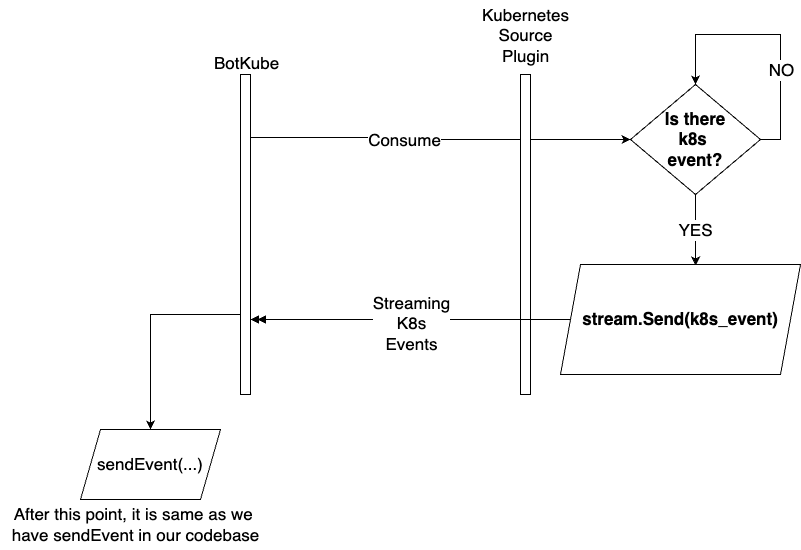

# Event Manager Extensibility

Created on `2022-09-28` by Huseyin BABAL ([@huseyinbabal](https://github.com/huseyinbabal))

| Status                                   |
|------------------------------------------|
| `PROPOSED/REJECTED/ACCEPTED/IMPLEMENTED` |

## Overview

<!--
General overview of the proposal and section with ToC
-->

<!-- toc -->
- [Motivation](#motivation)
  * [Goal](#goal)
  * [Non-goal](#non-goal)
- [Proposal](#proposal)
  * [Terminology](#terminology)
  * [Hashicorp's Go Plugin](#hashicorps-go-plugin)
  * [Source Plugin Structure](#source-plugin-structure)
  * [Executor Plugin Structure](#executor-plugin-structure)
  * [Cloud Events](#cloud-events)
    + [Botkube Cloudevents Data Structure](#Botkube-cloudevents-data-structure)
- [PoC](#poc)
  * [Motivation](#motivation)
  * [Folder Structure](#folder-structure)
    + [API Folder](#api-folder)
    + [Plugins Folder](#plugins-folder)
  * [How to build plugins?](#how-to-build-plugins)
  * [How can I know the metadata of plugins?](#how-can-i-know-the-metadata-of-plugins)
  * [How can I provide plugin configuration?](#how-can-i-provide-plugin-configuration)
  * [How to install/uninstall plugins?](#how-to-installuninstall-plugins)
  * [How to Upgrade Plugins?](#how-to-upgrade-plugins)
  * [Where is the actual plugin process?](#where-is-the-actual-plugin-process)
  * [Example](#example)
  * [Consequences](#consequences)
- [Alternatives](#alternatives)
  * [Golang and Extensibility](#golang-and-extensibility) 

<!-- tocstop -->
## Motivation
Currently, we have support for 5 integrations for Botkube and Botkube is designed to listen events from Kubernetes
and execute kubectl commands. In this design documentation, we aim to provide an architecture where end users can 
extend Botkube to have their integrations with respective configurations. Even this doc is initiated to extend event 
manager, having a general extension/plugin mechanism will bring a huge value to Botkube

### Goal
1. Introduce a feature for sources so that Botkube can accept events from sources other than Kubernetes.
2. Introduce a feature for executors so that Botkube can handle custom commands via extensions.

### Non-goal
1. Initially, we don't need to cover executor flow physically, but with a proper architecture, we can cover both events (coming from sources) executors

## Proposal
### Terminology
There are already a bunch of design patterns that help you to extend your system with additional capabilities. For example,
with proper dependency injection system, you can define an interface for the contract and implement different algorithms
based on that. In Botkube we might have a `Source` interface, and `KubernetesSource`|`PrometheusSource` would
be good candidates for concrete implementations. with the help of Dependency Injection, you can decide on which implementation
to call in runtime.


Based on the above diagram, Botkube only knows `Source` interface, and calls `Consume()` method to execute the logic in 
the real implementation. For example, if you register `KubernetesSource` implementation, Botkube can consume Kubernetes
events. In same way, `PrometheusSource` can consume Prometheus events, or it can add an endpoint to Botkube to let Prometheus
send alerts to this endpoint. Those examples can be extended, but is there another way to add those extensions in more detached way?
For example, instead of forcing to implement interfaces, what about we add plugins, and they are being called automatically by
main process (Botkube in our case). By doing that, plugins and core Botkube implementation can be independent and easy to maintain.

### Hashicorp's Go Plugin
There are several alternatives to plugin systems in Golang, but I want to focus specifically on 
[Hashicorp's Go Plugin](https://github.com/hashicorp/go-plugin) system. In this plugin system, main application talks to 
plugin via RPC. Botkube is a client in this case, and it calls plugin implementation via RPC and uses response returned from 
plugin. It basically uses file descriptor in local file system to communicate like a local network connection. 


### Source Plugin Structure
In above diagram, RPC is the base protocol and in our case it is possible to use gRPC. If we think `KubernetesSource` again, 
Botkube can connect to `KubernetesSource` plugin and think about this is a server-side streaming. The Kubernetes consuming logic is
located in that plugin and whenever it gets an event from Kubernetes, it can stream it to client which is Botkube. The main
advantage of this usage, we can use any language to implement a plugin which supports gRPC. 



Source plugin does not necessarily need to implement a logic since some sources may want to have just configuration for the plugin in
Botkube. Instead of source logic, they may want to send events directly to Botkube
with a payload in [cloud events schema format](https://cloudevents.io/) which we will see soon. 

Events with cloudevents format can be easily consumed by Botkube once we have the handler. However, we may need to have custom
handler like Prometheus. Prometheus has a special event format, and we can redirect that events to specific destination with 
Prometheus job configuration. In Source Plugin architecture, it can also spin up a custom handler instead to handle Prometheus 
event payload and process it in Botkube. This is a typical example to show how we can have a dynamic handling mechanism for Source Plugins.

To sum up source plugin system;
- They can consume external system like Kubernetes events
- They can be in noop format, and they would have only plugin configuration to register that in Botkube
- They can also spin up an handler to handle custom events from other sources like Prometheus


### Executor Plugin Structure
Executor plugins would have nearly same flow as Source Plugins with a small difference. Executor plugins would be triggered
whenever Botkube receives a command from end-user. So, once Botkube receives command, based on the command prefix it can 
resolve which plugin to call and uses response on gRPC execution. Think about `KubectlExecutor`, once Botkube gets `kubectl get pods`
it can resolve plugin by its prefix which is `kubectl` and call `KubectlExecutor` gRPC endpoint automatically and parses the response.
As you can also see, Botkube does not need to know how `kubectl` works, it simply delegates all the responsibility to specific plugin.


### Cloud Events
Cloudevents schema has a proven standard for the cloud native industry where well-known products uses this schema to distribute their events
via this contract. The main take of this, you don't need to re-invent wheel from scratch while you are designing your data format. In Botkube,
we can also use [one of the Cloudevents SDK](https://github.com/cloudevents/sdk-go) to spin up an handler inside Botkube so that any cloudevents 
compatible source can send data to Botkube. The main example to this is [Keptn](https://keptn.sh/), an open source application life-cycle orchestration tool, 
they send events in cloudevents format. If we want to ship Keptn events to Botkube to be able to send notifications, we may need to add new integration to Keptn
so that it will send events to Botkube `/events` endpoint which handles cloudevents.

#### Botkube Cloudevents Data Structure
You will see very simple suggested event format for Botkube as shown below.
```json
{
  "id" : "e2361318-e50b-472e-8b17-13dbac1daac1",   
  "source" : "Kubernetes",     
  "specversion" : "1.0",                             
  "time" : "2022-03-23T14:35:39.738Z",               
  "data" : {                                         
    "namespace" : "Botkube",
    "deployment" : {
      "name" : "test",
      "replicas" : 5
    }
  }
}
```

`id`: This is the unique identifier for the event, and this should be decided by end users. UUID is not a mandatory stuff, it can
be also ARN for example `ec2:myinstance:12345`.

`source`: This refers to plugin name. Once Botkube receives and event on `/events` endpoint, `source` field would be validated
to see we already have a registered plugin for this event or not. 

`specversion`: To have proper versioning for Botkube event format.

`time`: Event time in Unix time format to not deal with date parsing. 

`data`: This is the event data that contains important information about source. what you see in `data` section is just example,
we can also add some kind of validation in Botkube to better use received data. For example, if we force user to send key value pairs,
we can easily apply templating/filtering to this event to full-fill our future stories about sending custom notifications to slack.
Data structure is strongly opened to suggestion.

As you can also understand, data field contains generic data which can vary for plugins. For internal usage, we can create a general event data structure, but
I haven't included the final structure for that, I believe it can be generated from scratch during real implementation.

## PoC
### Motivation
The main motivation of the PoC is to come up with a simple playground project that explains how it looks like to have a plugin system for Botkube.
There are 2 projects to better show the entire flow: `Botkube-plugins` (https://github.com/huseyinbabal/Botkube-plugins) and `Botkube-plugins-playground` (https://github.com/huseyinbabal/Botkube-plugins-playground). `Botkube-plugins` repository simply contains
community-driven plugins and also some `api` related packages to help consumers (e.g. Botkube) to initialize plugin base to use as a pluggable component.
`Botkube-plugins-playground` is a sample project that shows how we can use `Botkube-plugins` repository as plugin marketplace. Now let's take a look `Botkube-plugins` project 
to understand how it is structured.

### Folder Structure

The plugin system contains 2 packages: `api` and `plugins`. `plugins` package is for end users and they can come up with their own
plugins to include them after PR approval. `api` package contains the logic to manage Botkube plugins. Let's deep dive those folders
to understand them a bit better.

#### API Folder
This folder contains api packages to help consumers initialize plugins in client side. This package simply contains proto definitions to describe
contract between client (Botkube) and server (Actual plugin). As you can guess, it become easier once we use gRPC since Hashicorp's plugin system works
on RPC and the integration is so simple. 

API folder contains `source` and `executor` folders to have more meaningful package names once we generate actual implementation of proto files. Apart from proto files, 
you can see base gRPC server and client implementations in `grpc.go` which is shared among plugins. `interface.go` contains the actual API to expose to consumers. Finally,
`plugin.go` is for plugin definition which is a simple struct for Hashicorp's Go plugin system.

#### Plugins Folder
In this folder, you can see examples `kubectl` and `Kubernetes`. Each plugin has its own dedicated folders which are typically go module projects. 
Each plugin folder contains a simple Go file which contains the actual business logic of plugin. You can also see a `Makefile` to manage the build
process of that plugin. They might not be a simple Go program, that's why there is no unified `Makefile` that builds any Go project, it can contain
customer specific build flows. For `kubectl` and `Kubernetes`, they are same for now. 

### How to build plugins?
`plugins` folder only contains the source code of the plugins, and consumer (Botkube or playground project on our case), needs the executable versions
of those plugin to call via Hashicorp's plugin package. There is a Github Action for plugin release flow which you can see [here](https://github.com/huseyinbabal/Botkube-plugins/blob/main/.github/workflows/release.yaml). 
In this flow, the only thing you need to do is pushing a new tag in a format `<plugin_name>/<version>` like `Kubernetes/v1.0.7`. This will build `Kubernetes` plugin, create a release with version
`v1.0.7` and go binary executable will be attached to release artifacts. Notice that, those artifacts are used in consumer side to be used as parameter to Hashicorp's Go Plugin.

### How can I know the metadata of plugins?
In `Botkube-plugins` project, we have a plugin index file as you can also see it [here](https://github.com/huseyinbabal/Botkube-plugins/blob/main/index.json). That contains basic metadata of each plugin, and notice that they are managed manually
right now, we can automate and do find/replace whenever there is a change to plugins. Here is an example;
```json
[
  {
    "name": "Kubernetes",
    "type": "source",
    "description": "Kubernetes source plugin to consume events from Kubernetes Events API.",
    "version": "v1.0.9"
  },
  {
    "name": "kubectl",
    "type": "executor",
    "description": "Kubectl executor plugin to handle given command in configured k8s cluster.",
    "version": "v1.0.9"
  }
]
```

### How can I provide plugin configuration?
If you use terraform before, they use a notation like `<pluginname>_...` to pass settings to specific plugin. So, in Botkube, if somebody provides `KUBERNETES_CONFIG_PATH=something`, the `kubernetes` plugin executable can be run as follows.
```go
client := plugin.NewClient(&plugin.ClientConfig{
    Plugins:          m.pluginMap(metadata),
    VersionedPlugins: nil,
    Cmd:              exec.Command(metadata.Path, "--config", "something"), // Plugin specific params goes here
    AllowedProtocols: []plugin.Protocol{plugin.ProtocolGRPC},
    HandshakeConfig: plugin.HandshakeConfig{
        ProtocolVersion:  1,
        MagicCookieKey:   "BOTKUBE_MAGIC_COOKIE",
        MagicCookieValue: "BOTKUBE_BASIC_PLUGIN",
    },
})
```

`type` can be `source` or `executor` since we decide on plugin implementation contract based on that value.

### How to install/uninstall plugins?
Once you initialize plugin, it collects plugin metadatas from plugin index and initializes all of them by using Hashicorp's plugin system.
Each plugin is downloaded to a local cache from Github artifacts. Most probably, in Botkube there will be a configuration section to decide
enable/disable plugins. So, plugin executable is in local cache, and disable might be removing it from plugin list, so that Botkube will not initialize it on next 
restart. we can enable disable plugins dynamically by using Hashicorp's Go plugin API, but I haven't experimented it. At worst case, we can update configuration and restart Botkube app.

### How to Upgrade Plugins?
In Botkube configuration, we will have plugin names with their versions, so if you want to upgrade a specific version, it would be enough to change it in config and restart application.

### Where is the actual plugin process?
Plugin process is managed by Hashicorp's Go Plugin and it creates a subprocess from actual Go program. So, Botkube Go process will create another process, and Hashicorp's Go Plugin
helps us to communicate with this sub process. In Kubernetes environment, it will be in same pod. No need to worry about size, since only the required plugins will be donwloaded
to local cache (user's home folder/.Botkube-plugins).

### Example
You can see a working example [here](https://github.com/huseyinbabal/Botkube-plugins-playground)

### Consequences
If we agree on this design, we can extend this epic with following description to come up with new tasks.

- [ ] Maintain Botkube plugins under Kubeshop organization
  - There is a working version of [botkube-plugins](https://github.com/huseyinbabal/botkube-plugins), move it to Kubeshop Github organization
  - Check module names in the [botkube-plugins](https://github.com/huseyinbabal/botkube-plugins) project and set repo owner parts as `kubeshop` after migrating to Kubeshop organization.

- [ ] Add plugin contribution documentation
  - Prepare a documentation for adding new plugin to Botkube Plugins.
  - It should contain how to verify plugin functionality in PR checks.
  - Boilerplate template for plugin development. Please refer [here](https://github.com/huseyinbabal/botkube-plugins/tree/main/plugins/kubectl) for an example.
  - Once needed, provide a mocking mechanism to write tests for specific plugin.
  
- [ ] Add plugin manager to Botkube
  - Plugin manager can accept plugin configuration with name and version.
  - It should download plugin executable by using name and version to specified local folder before running Botkube application
  - There should be a caching mechanism to not download same version again.
  - You can see working example [here](https://github.com/huseyinbabal/botkube-plugins-playground/blob/main/plugin/manager.go)

- [ ] Extract Kubernetes source feature as a plugin 
  - Currently, Kubernetes source events are tightly coupled with Botkube, we can add sourcing mechanism as `kubernetes` plugin. You can see independent example [here](https://github.com/huseyinbabal/botkube-plugins/tree/main/plugins/kubernetes)
  - It should be background compatible.
  - Plugin specific parameters should be passed during plugin initialization. Hashicorp's Go plugin system, runs plugin executable as sub process, so it also accepts exec arguments where we can resolve configuration and pass them as separate arguments
  - Plugin parameters will be documented in [botkube-plugins](https://github.com/huseyinbabal/botkube-plugins) repo, and they can be provided from Botkube as an environment variable like `KUBERNETES_...` so that they can be passed to executable [in this line](https://github.com/huseyinbabal/botkube-plugins-playground/blob/c85cb7b84296a2f41c2dcdd8cac77c0e9dd9c69a/plugin/manager.go#L159)
  - Data structure for events
    - Since each source plugin has different data structure, we cannot have a general data structure except we specified #Cloud Events. `data` field has free data structure, but we can convert them to map then extract 
any section based on customer definition by using Go template. `data` field has free structure, but we can put mandatory fields in this struct like `message`, `user`, etc. Or we can put mandatory fields to cloud events schema as shown below.
      ```json
      {
      "id" : "e2361318-e50b-472e-8b17-13dbac1daac1",   
      "source" : "Kubernetes",     
      "specversion" : "1.0",                             
      "time" : "2022-03-23T14:35:39.738Z",               
      "message": "DB instance not found",
      "user": "john",
      "data" : {                                         
        "namespace" : "Botkube",
          "deployment" : {
            "name" : "test",
            "replicas" : 5
          }
        }
      }
      ```
- [ ] Extract Kubectl executor feature as a plugin
  - Extract kubectl executor as plugin and maintain it in [botkube-plugins](https://github.com/huseyinbabal/botkube-plugins) repository.
  - Ensure it is background compatible.
  - Plugin parameters will be documented in [botkube-plugins](https://github.com/huseyinbabal/botkube-plugins) repo, and they can be provided from Botkube as an environment variable like `KUBERNETES_...` so that they can be passed to executable [in this line](https://github.com/huseyinbabal/botkube-plugins-playground/blob/c85cb7b84296a2f41c2dcdd8cac77c0e9dd9c69a/plugin/manager.go#L159) 
  
- [ ] Keptn as an alternative source plugin
  - Once we have Botkube cloud events handler, we will be able to accepts from outside. However, we cannot have an endpoint that accepts all kind of data format. Assume that we have a payload format as described in Cloud Events section. In order to accept Keptn events, we can implement a Botkube plugin on Keptn, and this plugin will be responsible for taking events from Keptn, convert and send it to Botkbue.
  - Implement a Keptn plugin on their plugin marketplace by following their [guidelines](https://keptn.sh/docs/integrations/#contributing) 

- [ ] Helm as alternative executor plugin
  - Implement Helm plugin for Botkube
  - Design a configuration structure for helm executor plugin
  - Document it in [botkube-plugins](https://keptn.sh/docs/integrations/#contributing) repository.
 
## Alternatives
### Golang and Extensibility
Golang has [plugin](https://pkg.go.dev/plugin) package which you can use to add an extension system to your existing Go project.
This package has some limitations as follows;
- Once a problem occurs in plugin, it also crashes the host process (your main program, which is Botkube in our case).
- You can load the plugin during the initialization, then reload is not supported.
- You need to maintain conflict of shared libraries.
<!--
What other approaches did you consider, and why did you rule them out? These do
not need to be as detailed as the proposal, but should include enough
information to express the idea and why it was not acceptable.
-->
