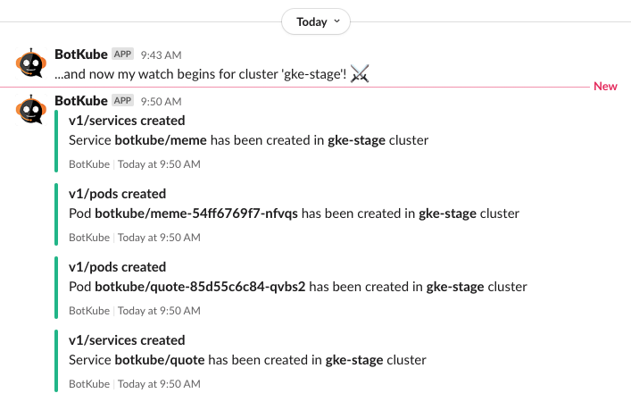
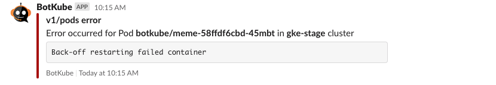

# BotKube Use Case: Collaboratively debug Kubernetes resources via Slack

This example showcase debugging failing Pod with network issue. You will learn:

- how BotKube notifies you about errors
- how to execute `kubectl` commands via `@Botkube`
- how the `kubectl` permission restriction works

## Prerequisites

Install the following applications:

- [k3d](https://k3d.io/v5.4.6/)
- [Helm](https://helm.sh/)
- [Kubectl](https://kubernetes.io/docs/tasks/tools/#kubectl)

### Set up local Kubernetes cluster

Run the command:

```bash
k3d cluster create svc-debug
```

### Deploy BotKube

1. Install [BotKube in your Slack workspace](https://botkube.io/installation/slack/#install-botkube-slack-app-to-your-slack-workspace).

2. Export required environment variables:

   ```bash
   export SLACK_BOT_TOKEN="{token}"
   export TEAM_SLACK_CHANNEL="{channel}" # e.g. gophers
   export ADMIN_SLACK_CHANNEL="{channel}" # e.g. admin
   ```

   > **Note**
   > The channels must exist and the BotKube bot must be added to them.

3. Add BotKube Helm chart:

   ```bash
   helm repo add botkube https://charts.botkube.io
   helm repo update botkube
   ```

4. Deploy BotKube:

   ```bash
   helm install botkube --version v0.13.0 --namespace botkube --create-namespace \
   -f ./examples/service-debugging/botkube-values.yaml \
   --set communications.default-group.slack.token=${SLACK_BOT_TOKEN} \
   --set communications.default-group.slack.channels.default.name=${TEAM_SLACK_CHANNEL} \
   --set communications.default-group.slack.channels.admin.name=${ADMIN_SLACK_CHANNEL} \
   --wait \
   botkube/botkube
   ```

### Deploy example app

Run the command:

```bash
kubectl apply -f ./examples/service-debugging/deploy
```

## Scenario

In this scenario, we will learn how to react to the error event sent on Slack channel.

1. Open the team Slack channel.

2. You should see new events sent by BotKube about created service:

   

3. After a minute, you should see an error event:

   

   Let's start the investigation! 🕵️

4. For now, we don't know too much about the error itself. To learn more, let's check the `meme` Pod logs:

   ```
   @Botkube logs -l app=meme
   ```

5. From the logs, we learned that the `meme` Pod cannot call the `quote` Pod using the defined Service URL. To be able to call the `quote` Pod, we definitely need to have the `quote` Service defined. To get all Services, run:

   ```
   @Botkube get services
   ```

6. We can see that the `quote` Service is there, so we need to dig deeper into the configuration. We need to describe Service to check if there are any endpoints:

   ```
   @Botkube describe svc quote
   ```

   Now it gets interesting: there are no endpoints, which means there isn't a single Pod that is matched by the Service selectors.

7. We need to check whether the `quote` Pod is up and running:

   ```
   @Botkube get pods
   ```

   💡 The `quote` Pod is up and running, so it might be a problem with incorrect labels.

8. There is a handy `--show-lables` flag which allows us to check that easily:

   ```
   @Botkube get po {quote_pod_name} --show-labels
   ```

   🎉 We got it! The bug was found. The problem is with incorrect labels. The `quote` Service matches only Pods with the `app=quote` label, which is missing on our Pod!

9. Add missing label to the `quote` Pod:

   ```
   @Botkube label pod {quote_pod_name} app=quote
   ```

   If you execute that command in team channel, you will get an error. But that's yet another BotKube feature, which allows you to define executor permission per channel.

10. To be able to run the label command, you must switch to the admin channel.

11. Once again, try to label to the `quote` Pod:

    ```
    @Botkube label pod {quote_pod_name} app=quote
    ```

12. Restart the `meme` Pod:

    ```
    @Botkube delete po -l app=meme
    ```
    > **Note**
    > The `quote` Pod is managed by Deployment, so once we delete the Pod, it will be automatically recreated.

13. Run `logs` to confirm that `http://quote/quote` is reachable now:

    ```
    @Botkube logs -l app=meme
    ```

14. **(Optional)** From your terminal, forward the `meme` Service to your localhost:

    ```bash
    kubectl port-forward svc/meme 9090:80
    ```

    Navigate to [http://localhost:9090/meme](http://localhost:9090/meme).

Hurray! We are up and running again! 🥳

### Summary

During the short demo, you can notice that:

- You don't need to install and configure any tools locally
- You don't need to repeat commands that were already executed by others
  - and you don't need to discover the same thing by your own when it was already discussed by the teammates
- You don't need to switch context - switch between Slack and your terminal
- You can define different `kubectl` permissions per channel

If you are very observant, you probably noticed that events were sent only to the team channel and not to the admin one. This is possible with a single BotKube instance. To learn more, check [Source and Executors Bindings](https://botkube.io/configuration/communication/#source-and-executor-bindings).

## Cleanup

Remove the `svc-debug` cluster:

```bash
k3d cluster delete svc-debug
```
