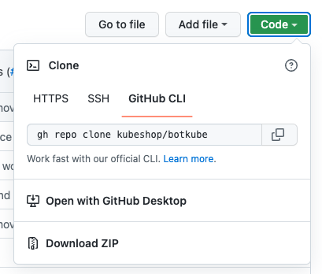

# Git workflow

This document describes the best practices when working with BotKube repositories.

## General rules

Each contributor and maintainer must follow this workflow:

- Work on forked repositories.
- Create branches on the fork and avoid working directly on the `main` branch.

## Prepare the fork

A fork is a copy of the repository from which you raise pull requests to propose changes to the original repository. The contribution workflow that bases on forks allows both the members of the BotKube repositories, and the external contributors to contribute code and content through the same process. This keeps the main repositories clean as contributors create branches only on the forked repositories.

To create the fork, click **Fork** button in the upper-right corner of the repository's main page.


## Configure the fork

> **Note**
>
> The document refers to the original repository as the `upstream` repository and to the forked repository as the `origin` repository.

To make it easy to synchronize the changes from the upstream repository, configure a new Git `remote` and set the synchronization of the `main` branch to the new `remote`.

1. Clone the fork to your local machine. Use the **Code** button on the repository's main page to view the command to use.

   

2. Navigate to the location of the cloned repository.
3. To see the current configured remote repositories, run the following command:

    ```bash
    git remote -v
    ```

   The result has the following format:

    ```bash
    origin  https://github.com/{your-username}/{repository}.git (fetch)
    origin  https://github.com/{your-username}/{repository}.git (push)
    ```

4. Specify a new remote upstream repository to synchronize with the fork:

    ```bash
    git remote add upstream git@github.com:kubeshop/botkube.git
    ```

5. Disable pushing changes directly to the upstream:

   ```bash
   git remote set-url --push upstream no_push
   ```

6. Fetch all remote branches:

    ```bash
    git fetch --all
    ```

7. Set the local `main` branch to track the remote `main` branch from the upstream repository:

    ```bash
    git branch -u upstream/main main
    ```

From now on, every time you pull the changes from `main` branch on the local repository, you refer to the `main` branch of the upstream repository.

## Contribute

### Basic flow

After you set up your fork, start contributing. Follow these steps:

1. Check out the `main` branch.

    ```bash
    git checkout main
    ```

2. Pull the latest changes:

    ```bash
    git pull
    ```

3. Create a new branch:

    ```bash
    git checkout -b {branch-name}
    ```

4. Change proper files according to what you want to contribute.
5. Select changes to commit. To include all changes you made within the repository, use:

   ```bash
   git add -A
   ```

6. Commit changes:

    ```bash
    git commit -m "{your message}"
    ```

7. Push changes to the origin repository:

    ```bash
    git push -u origin {branch-name}
    ```

8. Open a pull request from GitHub UI or CLI.

    - For the pull request title, use the following rules:
      - Include a short description of changes made.
      - Use the imperative mood.
      - Capitalize it.
      - Do not end the subject line with a period.
    - For the pull request description, adhere to the pull request template.

### Keep branch up to date

To keep the branch up to date, execute the set of following commands:

```bash
# Update the main branch by pulling all changes
git pull upstream main:main
# Reapply your commits one by one on the top of the main branch
git rebase main
```

In case of any conflicts during the rebase, run:

```bash
git rebase --abort
```

Follow the [Rewriting history](https://git-scm.com/book/en/v2/Git-Tools-Rewriting-History) chapter from the "Pro Git" book to squash your commits into one.

Retry the rebase, resolve all conflicts and continue the rebase with the command:

```bash
git rebase --continue
```
